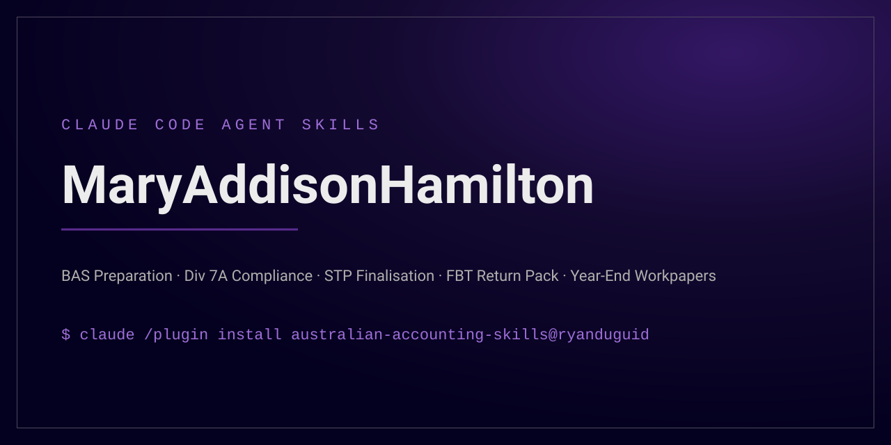

# australian-accounting-skills



[](https://github.com/ryanduguid/MaryAddisonHamilton/actions/workflows/verify.yml) [](LICENSE)

Claude Code skills for Australian public-practice accounting workflows: BAS, FBT, Division 7A, STP finalisation, month-end close, year-end workpapers, 13-week cashflow forecasting.

Each skill encodes the *workflow* (the steps, the tie-outs, the exceptions to chase) rather than tax content. Rates, thresholds and due dates change every year, so skills direct the agent to verify current figures at ato.gov.au rather than hardcoding numbers that go stale.

## Who this is for

Accountants in Australian public practice (and finance staff in AU SMEs) using [Claude Code](https://claude.com/claude-code). Claude Code is the agent these skills are tested with. Other agents that read `SKILL.md` files should work, but I have not tested them. Assumes Xero as the primary ledger; most skills work from standard CSV exports and degrade gracefully with no integrations at all.

## Install

### Claude Code plugin

This repo is also a Claude Code plugin marketplace, so all nine skills install together and
update with the repo:

```
/plugin marketplace add ryanduguid/MaryAddisonHamilton
/plugin install australian-accounting-skills@ryanduguid
```

The skills then register as `australian-accounting-skills:bas-preparation` and so on.

### Any agent, via the skills CLI

One command, using the [`skills` CLI](https://github.com/vercel-labs/skills). It reads the
`.claude/skills/` layout this repo uses, so no extra manifest is needed:

```bash
npx skills add ryanduguid/MaryAddisonHamilton
```

That installs into the current project (`./.claude/skills/`). Add `-g` to install into
`~/.claude/skills` instead, `-a claude-code` to target one agent, and `-l` to list the skills
without installing anything.

### By hand

Copy the skills you want into your project or user skills directory:

```bash
git clone https://github.com/ryanduguid/MaryAddisonHamilton australian-accounting-skills
mkdir -p ~/.claude/skills
cp -r australian-accounting-skills/.claude/skills/* ~/.claude/skills/
```

PowerShell:

```powershell
git clone https://github.com/ryanduguid/MaryAddisonHamilton australian-accounting-skills
New-Item -ItemType Directory -Force "$HOME/.claude/skills"
Copy-Item -Recurse australian-accounting-skills/.claude/skills/* "$HOME/.claude/skills/"
```

Or copy individual skill folders into `<project>/.claude/skills/`. The skills cross-reference each other (`bas-preparation`, `stp-finalisation`, `workpaper-tie-out`, `fbt-annual-workflow` and `xero-exports` are shared dependencies), so installing the full set works best. For a firm repository, adapt [`templates/firm-CLAUDE.md.example`](templates/firm-CLAUDE.md.example) to its actual policy; this repository's [`CLAUDE.md`](CLAUDE.md) is contributor guidance, not a substitute for firm controls.

### Versioning

The nine skills are released and tested as a set at each tagged release.
Installing a subset by hand can break skills that call their siblings:

- `bas-preparation`, `month-end-close` and `year-end-workpapers` depend on `xero-exports`
- `fbt-annual-workflow` and `stp-finalisation` depend on each other (RFBA hand-off)
- `year-end-workpapers` depends on `bas-preparation`, `stp-finalisation` and `workpaper-tie-out`

Install the full pack at a tagged release to keep the set consistent.

## First run

Minimal path from install to one verified result, assuming Claude Code is already installed:

1. Install the plugin (see above): `/plugin marketplace add ryanduguid/MaryAddisonHamilton` then `/plugin install australian-accounting-skills@ryanduguid`.
2. Export three reports from Xero for your most recent completed BAS period: the GST Audit Report, the trial balance as at period end, and the GL detail for the GST control account(s). Use a demo or fabricated file if you are only trialling; keep real client exports inside firm policy.
3. In Claude Code, in the folder holding those exports, ask: "Prepare a BAS workpaper for the quarter ended 31 March from these exports. Cash basis, quarterly lodger." The `bas-preparation` skill picks this up and asks for anything missing.
4. Verify the result yourself: check that net GST on the workpaper (1A less 1B) ties to the movement in the GST control account for the period. If the workpaper shows that tie-out and lists its exceptions, it worked.

Uninstall with `/plugin uninstall australian-accounting-skills@ryanduguid` (or delete the copied folders from `~/.claude/skills/` if you installed by hand).

## Worked example: bas-preparation

**Input.** A quarterly BAS for a small company on the cash basis. You supply the GST Audit Report, the trial balance, GL detail for the GST control accounts, prior period BAS figures, and the payroll activity summary.

**What the skill checks.** It confirms the report basis matches the entity's ATO registration basis first, and stops and flags a mismatch rather than continuing. It maps ledger figures only to the labels actually present on the entity's statement (it will not invent a W1 just because payroll data exists; large withholders reporting through STP may not need one). It ties net GST (1A less 1B) to the movement in the GST control account to the cent, using the cash-basis bridge where the ledger is on accruals. It scans for coding exceptions such as GST claimed on bank fees, stamp duty or wages, and compares each label to the prior period and same period last year, asking you for the firm's variance threshold rather than inventing one.

**Output and escalation.** A review-ready workpaper: summary page with labels, amounts and tie-out proof, an exceptions list with resolutions, preparer and date, and space for reviewer sign-off. It does not lodge and does not draft ATO correspondence; that stays with the registered agent. If it cannot verify a current rate or label at ato.gov.au, it stops, asks you for the figure, records it as "per [name], [date], unverified", and flags it on the workpaper.

## Skills

| Skill | Use it for |
|---|---|
| `bas-preparation` | Prepare/review a BAS from ledger exports; label mapping, GST control account tie-out |
| `month-end-close` | Checklist-driven close: bank recs, control accounts, accruals, variance review |
| `workpaper-tie-out` | Audit-style verification: every statement line traced to workpaper and source |
| `fbt-annual-workflow` | FBT year-end: benefit identification, declarations, gross-up, RFBA |
| `div7a-compliance` | Division 7A loan register, complying-agreement checks, minimum repayments |
| `stp-finalisation` | STP year-end finalisation: payroll vs GL vs filed totals, super guarantee checks |
| `year-end-workpapers` | Review-ready annual workpaper pack from a trial balance export |
| `xero-exports` | Pulling and parsing Xero reports: quirks, completeness checks, naming conventions |
| `cashflow-forecast-13week` | Rolling 13-week cashflow from bank balance, agings and ATO obligation timing |

Also included:

- [`templates/firm-CLAUDE.md.example`](templates/firm-CLAUDE.md.example): a starter `CLAUDE.md` for an accounting firm's repo.
- [`CLAUDE.md`](CLAUDE.md) and [`.claude/rules/accounting-safety.md`](.claude/rules/accounting-safety.md): maintained contributor and accounting-safety boundaries.
- [`validation/README.md`](validation/README.md) and [`scripts/validate_validation.py`](scripts/validate_validation.py): a fabricated regression pack and fail-closed static validator.

## Sibling command-line tools

These skills name two maintained CLIs rather than asking the agent to invent the same work:

- [`payday-super-check`](https://github.com/ryanduguid/payday-super-checker) for contribution timing against SGAA s 18C. The agent must not invent an SGC charge; that remains advice territory.
- [`export-tb`](https://github.com/ryanduguid/JohnSpenceOgilvy) (`xero-trial-balance-export`) for an optional API trial-balance CSV. The `xero-exports` file path remains the default for any practice.

## Design principles

1. **Workflow over content.** The skill knows the steps and the checks; the ATO website is the source of truth for this year's rates and labels.
2. **Tie-out or it didn't happen.** Every skill ends by reconciling its output back to source. That habit separates a workpaper from a guess.
3. **No client data in the repository.** Examples are fabricated from scratch. The `.gitignore` blocks common client-artefact patterns; keep real exports out of every repository and use them only where the engagement, firm policy and approved environment permit.
4. **Degrade gracefully.** Skills work from CSV exports on disk. Ledger integrations (MCP) are a bonus, never a requirement.

## Disclaimer

These skills are workflow aids for qualified professionals. They are not tax advice, not financial advice, and not a substitute for professional judgement or review. Verify all rates, thresholds and due dates against current ATO publications before relying on any output. Nothing here lodges anything. Lodgment is a registered agent's job.

If these skills are run with client inputs through a cloud AI service, that data passes to the service. Check your firm's policy and your confidentiality and privacy obligations first; de-identify by default. [`templates/firm-CLAUDE.md.example`](templates/firm-CLAUDE.md.example) has starter privacy rules.

## Author

Ryan Duguid, accountant in Newcastle NSW, CA ANZ Provisional Member.

## Licence

MIT. See [LICENSE](LICENSE). Provenance statement: [NOTICE](NOTICE).

